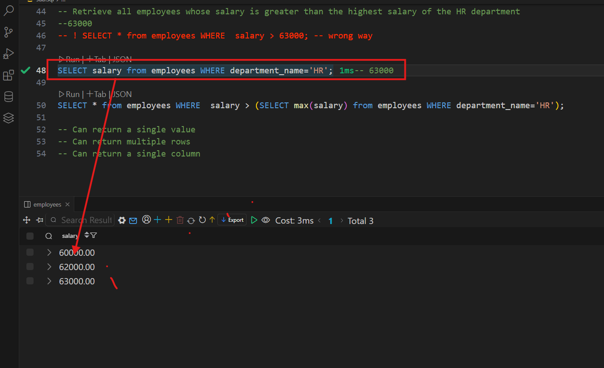
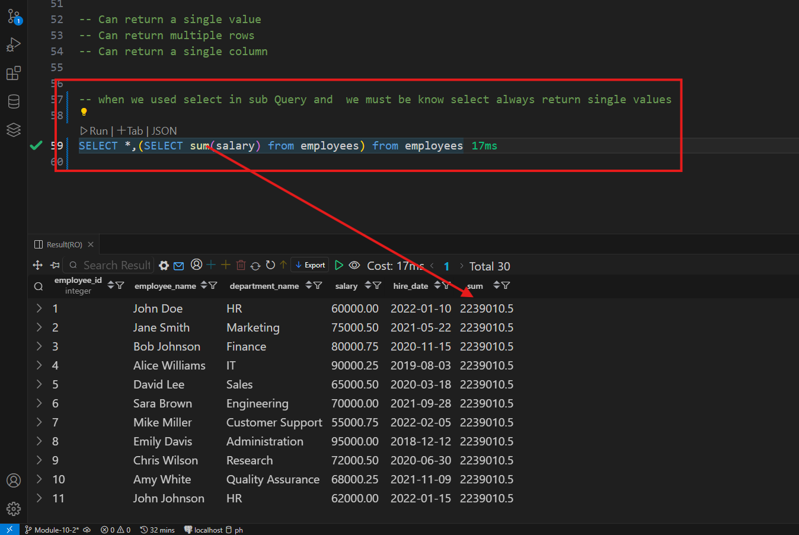

## Advanced Query Technique and Database objects in postgreSQL

## 10-2 Exploring Subqueries
- a sub query is a nested Query within another SQL statement

- this is single column 


```sql
-- Retrieve all employees whose salary is greater than the highest salary of the HR department
--63000
-- ! SELECT * from employees WHERE  salary > 63000; -- wrong way

SELECT salary from employees WHERE department_name='HR';-- 63000

SELECT * from employees WHERE  salary > (SELECT max(salary) from employees WHERE department_name='HR');

-- Can return a single value
-- Can return multiple rows
-- Can return a single column


-- we used in
SELECT 
FROM
where
```
## 10-3 Utilizing Subqueries in Different Clauses



``` sql

-- Can return a single value
-- Can return multiple rows
-- Can return a single column


-- when we used select in sub Query and  we must be know select always return single values

SELECT *,(SELECT sum(salary) from employees) from employees


-- from use
SELECT department_name,sum(salary) from employees GROUP BY department_name;
SELECT * FROM -- main query 
(SELECT department_name,sum(salary) from employees GROUP BY department_name) as sum_dept; -- sub query


--- where 
SELECT * from employees WHERE  salary > (SELECT max(salary) from employees WHERE department_name='HR');

SELECT employee_name, salary, department_name 
FROM employees 
WHERE department_name in 
(SELECT department_name FROM employees WHERE department_name LIKE '%R%');
```
## 10-4 Exploring Views in PostgreSQL

- any complex query easily we called the create view and not need many time write same query just select view query name

=========== Benefit use view=======
-- Simplifying complex queries
-- Improved security
-- Enhanced data abstraction


```sql
CREATE View dept_avg_salary
AS
SELECT department_name,avg(salary) from employees  GROUP BY department_name;


SELECT department_name,avg(salary) from employees  GROUP BY department_name;

SELECT * from  dept_avg_salary ;

CREATE VIEW test_view
as
SELECT employee_name, salary, department_name 
FROM employees 
WHERE department_name in 
(SELECT department_name FROM employees WHERE department_name LIKE '%R%');

SELECT * from test_view;
```